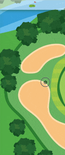
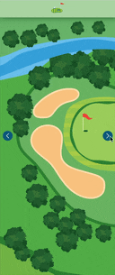

# Carte Interactive pour le Cours de Créative coding

## Étapes du projet
1. Réalisation d'un système de navigation sur la carte ; 
2. Réalisation des élément interctifs en AR ; 
3. Prototypage final.

---

## Étape 1

### Drag & drop v1
- Glisser la carte horizontalement pour découvrir le parcours de golf dans le ficher `draganddrop01.html`

### Drag & drop v2
- Glisser la carte dans toutes les directions pour visiter le terrain de golf dans son intégralité `draganddrop02.html`

### Slides
- Utiliser les boutons latéraux pour visiter l'ensemble du terrain de golf de la carte `slides01.html`

---

## Étape 2

### [RA basic](https://github.com/arcidiacono18/carte-interactive/blob/main/rabasic.html)

### [RA modifié](https://github.com/arcidiacono18/carte-interactive/blob/main/ramodified.html)

*Aperçu*

*Image cible*

### [RA multiple targets](https://github.com/arcidiacono18/carte-interactive/blob/main/ramultitarget.html)

*Image cible pour la version RA montrant divers objectifs sur un parcours de golf, incluant des voiturettes de golf.*

*Image cible*
