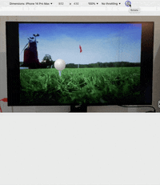

# Carte Interactive pour le Cours de Créative coding

## Étapes du projet
1. Réalisation d'un système de navigation sur la carte ; 
2. Réalisation des élément interctifs en AR ; 
3. Prototypage final.

---

## Étape 1

### Drag & drop v1
- Glisser la carte horizontalement pour découvrir le parcours de golf dans le ficher `draganddrop01.html`

### Drag & drop v2
- Glisser la carte dans toutes les directions pour visiter le terrain de golf dans son intégralité `draganddrop02.html`

### Slides
- Utiliser les boutons latéraux pour visiter l'ensemble du terrain de golf de la carte `slides01.html`

---

## Étape 2

### [RA basic](https://github.com/arcidiacono18/carte-interactive/blob/main/rabasic.html)

### [RA modifié](https://github.com/arcidiacono18/carte-interactive/blob/main/ramodified.html)
Faites pivoter votre appareil pour voir comment l'animation s'adapte à son orientation.

*Image cible*

### [RA multiple targets](https://github.com/arcidiacono18/carte-interactive/blob/main/ramultitarget.html)
Faites pivoter votre appareil pour voir comment l'animation s'adapte à son orientation.

*Image cible pour la version RA montrant divers objectifs sur un parcours de golf, incluant des voiturettes de golf.*

*Image cible une sac de golf*

---

## Étape 3

### Prototype final
Le prototype final se compose de 3 pages : une page info (utilisation), une page d'accueil et une page map.

#### [Maquettes figma](https://www.figma.com/design/vhT6F9XuxhkXA8LCk0fKl5/Creative-coding?node-id=0-1&t=FK8j2qeznjUuaJOJ-1)

Scénario : L'utilisateur se trouve dans un champ de golf, dans lequel il doit cliquer sur les objets cible afin d'ouvrir une modale qui lui fournit la description de l'image à scanner.

*Image cible 1*

*Image cible 2*

*Image cible 3*